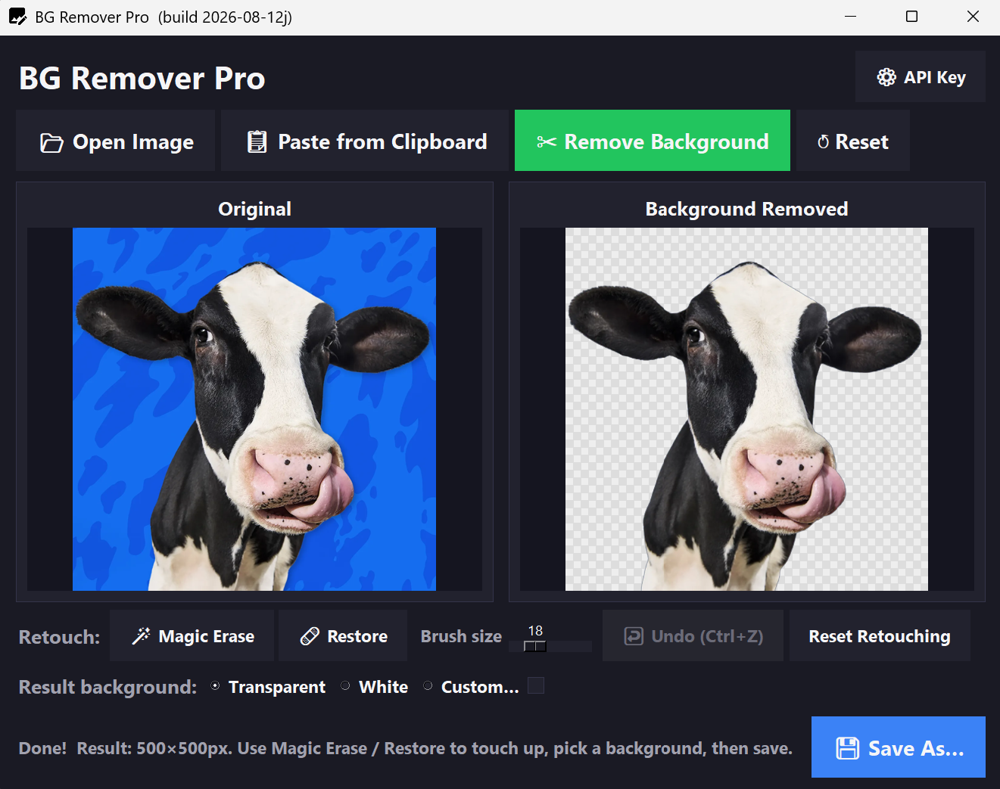

# 🪄 BG Remover Pro

A simple, elegant desktop app for removing image backgrounds using the [remove.bg API](https://www.remove.bg/api) — **full resolution**, no subscription or login wall like the free web app pushes on you.

Built with Python + Tkinter. No web browser, no upload limits beyond your own API plan, no watermarks.
<p align="center">
  
</p>

---

## ✨ Features

- 📂 **Open any image** — PNG, JPG, WEBP, BMP, TIFF — or 📋 **paste straight from your clipboard**
- ✂️ **One-click background removal** via the remove.bg API, requested at the highest resolution your API plan allows
- 🌀 A subtle scanning animation while it processes, echoing the feel of the web app
- 🪄 **Magic Erase** — brush away spots the AI missed
- 🩹 **Restore** — brush back real original pixels anywhere the removal was too aggressive
- ↩️ **Undo (Ctrl+Z)** — steps back one retouch action at a time, up to 20 steps
- 🎨 **Background options** for the result — transparent, white, or any custom color
- 💾 **Save As** with a remembered last-used folder, so batch-saving several images is fast
- 🖼️ Fully resizable, maximizable window — image previews scale proportionally with it
- 🔑 Your remove.bg API key is entered once and stored locally — never re-typed
- 🪟 Custom window/taskbar icon, and a proper Windows `.exe` icon when packaged

---

## 📦 Requirements

- Python 3.9+
- [`requests`](https://pypi.org/project/requests/)
- [`Pillow`](https://pypi.org/project/Pillow/)
- A free or paid [remove.bg API key](https://www.remove.bg/api)

```bash
pip install requests Pillow
```

---

## 🚀 Running it

```bash
python removebg.py
```

On first launch, you'll be prompted for your remove.bg API key. Get one free at [remove.bg/api](https://www.remove.bg/api) — it's saved locally so you only enter it once.

---

## 🧭 How to use it

1. **Open Image** (or paste one from your clipboard)
2. Hit **✂️ Remove Background**
3. Touch up with **🪄 Magic Erase** / **🩹 Restore** if needed — undo any stroke with **Ctrl+Z**
4. Pick a background — transparent, white, or a custom color
5. **💾 Save As…** — pick a spot, and it remembers that folder next time

---

## 🖥️ Custom icon (optional)

Drop `imageicon.ico` and/or `imageicon.png` in the same folder as `removebg.py`, and the app automatically uses it as the window/taskbar icon — including on popup dialogs like the API Key prompt.

---

## 🛠️ Building a Windows .exe

```bash
pip install PyInstaller

python -m PyInstaller --onefile --noconsole --icon=imageicon.ico ^
    --version-file=version.txt ^
    --add-data "imageicon.ico;." --add-data "imageicon.png;." ^
    removebg.py
```

- `--icon=imageicon.ico` sets the icon Windows shows for the `.exe` itself
- `--version-file=version.txt` embeds Product Name / Version info into the exe's Properties dialog
- `--add-data` bundles the icon files inside the exe so the *running app* can also load one as its in-window icon

Your built app lands in `dist\removebg.exe`.

---

## ⚠️ A note on resolution

remove.bg's *free API tier* still has its own resolution ceiling — that's set by your API plan, not by this app. What this app removes is the separate, extra "log in / subscribe for HD" wall the free **website** imposes on top of that.

---

## 📄 License
MIT License

Copyright (c) 2026 Mojtaba "Mo" Turkmani

Permission is hereby granted, free of charge, to any person obtaining a copy
of this software and associated documentation files (the "Software"), to deal
in the Software without restriction, including without limitation the rights
to use, copy, modify, merge, publish, distribute, sublicense, and/or sell
copies of the Software, and to permit persons to whom the Software is
furnished to do so, subject to the following conditions:

The above copyright notice and this permission notice shall be included in all
copies or substantial portions of the Software.

THE SOFTWARE IS PROVIDED "AS IS", WITHOUT WARRANTY OF ANY KIND, EXPRESS OR
IMPLIED, INCLUDING BUT NOT LIMITED TO THE WARRANTIES OF MERCHANTABILITY,
FITNESS FOR A PARTICULAR PURPOSE AND NONINFRINGEMENT. IN NO EVENT SHALL THE
AUTHORS OR COPYRIGHT HOLDERS BE LIABLE FOR ANY CLAIM, DAMAGES OR OTHER
LIABILITY, WHETHER IN AN ACTION OF CONTRACT, TORT OR OTHERWISE, ARISING FROM,
OUT OF OR IN CONNECTION WITH THE SOFTWARE OR THE USE OR OTHER DEALINGS IN THE
SOFTWARE.
